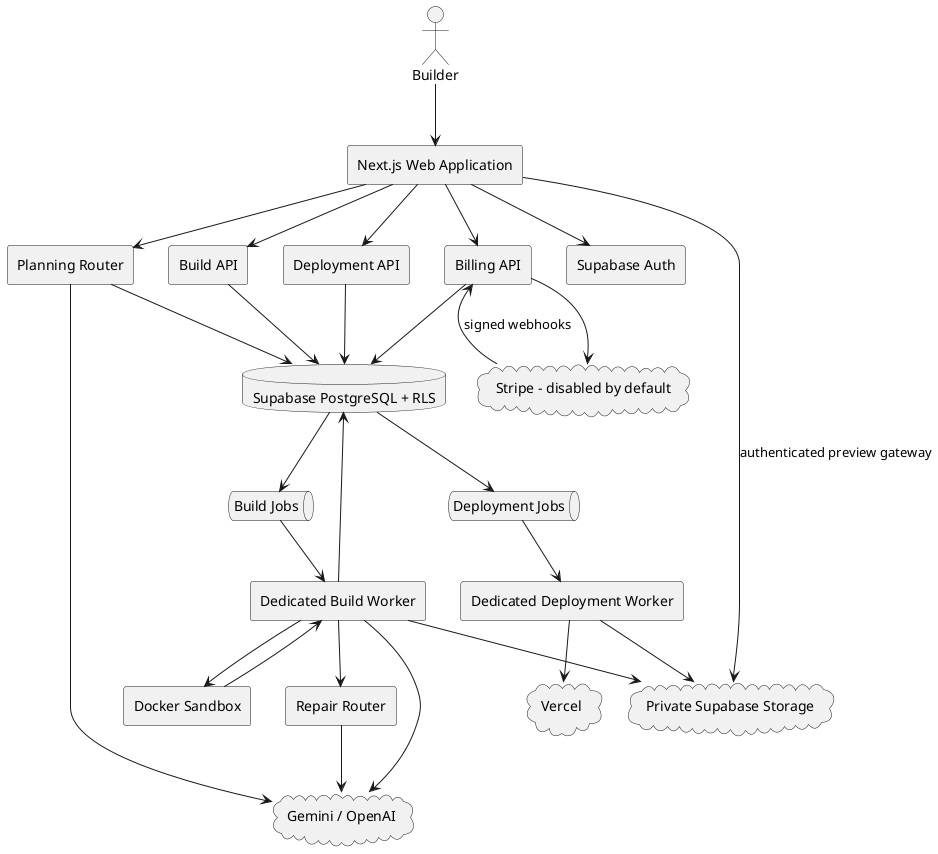
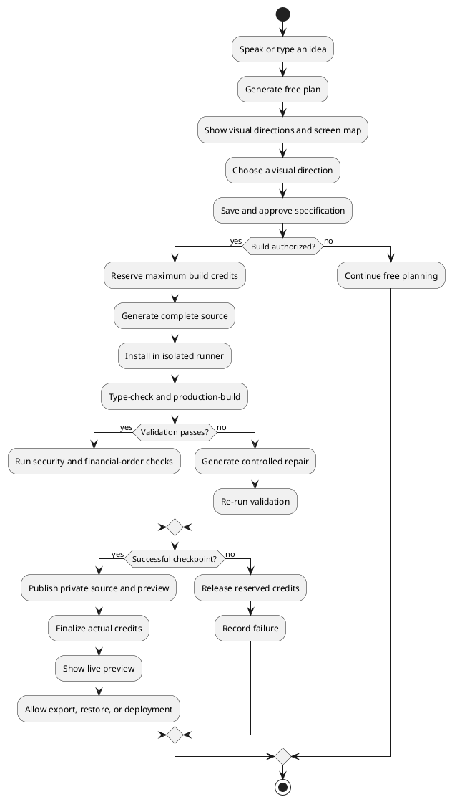
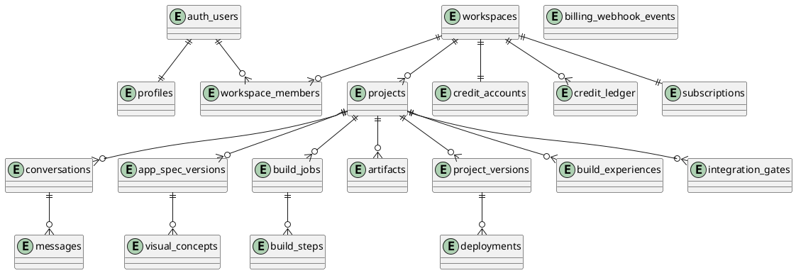

# SPEC-001-Ziepher-AI

## Background

Ziepher AI is a visual, voice-first application-building platform. A user speaks
or types an idea, receives a complete planning experience without spending build
credits, compares multiple visual concepts, and authorizes the system to
generate, run, test, repair, version, export, and deploy the application.

The product replaces the fragmented workflow of planning in a chatbot, copying
instructions into a coding agent, manually fixing build failures, and moving
source between hosting products. Planning, design direction, source generation,
quality validation, preview, recovery, deployment, and platform billing operate
inside one controlled workspace.

The working brand is **Ziepher AI** with the promise **Build Your Dreams**.

## Requirements

### Must

- Accept voice and typed idea input.
- Keep planning free to the user.
- Generate structured requirements, screens, features, data concepts, and build
  phases.
- Present several meaningfully different visual directions.
- Keep a live, interactive preview on the right side.
- Generate code only from an approved specification and selected visual concept.
- Use the least expensive route that meets the required quality level.
- Isolate generated-code execution from the web application and platform secrets.
- Validate installation, TypeScript, production compilation, source safety, and
  forbidden financial integration before publishing a version.
- Attempt a controlled repair when AI-generated source fails.
- Charge credits only for a successful checkpoint; release failed reservations.
- Preserve source archives, previews, version history, and restore operations.
- Support source ownership and export.
- Use Supabase for authentication, PostgreSQL, RLS, and private artifact storage.
- Add Stripe and other live money connections last.
- Keep Stripe disabled until the operator explicitly activates it.
- Make Stripe webhook processing and credit grants idempotent.
- Support preview and explicit production deployment.
- Record build experiences for controlled future improvement.
- Provide health, readiness, CI, security, and release procedures.

### Should

- Support economy, balanced, and best-quality modes.
- Support deterministic operation when no commercial AI key is configured.
- Escalate failed generation to a stronger configured model.
- Let users compare screens and visual directions before coding.
- Support email/password, magic-link, and Google OAuth sign-in.
- Present build, deployment, and recovery history.
- Support monthly and annual subscriptions.
- Allow provider changes without rewriting the orchestrator.
- Keep development, staging, and production environments separate.

### Could

- Add team workspaces, comments, approvals, and client portals.
- Add visual element selection and AI-generated component alternatives.
- Add native mobile, desktop, browser-extension, automation, and game builders.
- Add a community template and component marketplace.
- Add a GitHub App for repositories, pull requests, and bidirectional sync.
- Add Playwright accessibility and visual-regression workers.
- Train specialized models after enough consented and evaluated examples exist.

### Won't

- Let generated code execute in the public Next.js process.
- Let an AI directly rewrite production strategy without evaluation and rollback.
- Charge a user for failed system output.
- expose service-role, payment, or deployment secrets to generated projects;
- enable arbitrary live financial operations during the core build stage;
- interpret a consumer ChatGPT subscription as API billing.

## Method

### Production architecture



### User workflow



### Cheapest-best routing

```text
approved reusable component
→ deterministic transformation
→ cached project context
→ low-cost planning model
→ normal build model
→ configured escalation model after failure
```

The router uses deterministic output whenever it can produce a complete,
validated result. AI build routes return a strict `BuildArtifact`:

```typescript
type BuildArtifact = {
  appName: string;
  summary: string;
  files: Array<{ path: string; content: string }>;
  previewHtml: string;
  testPlan: string[];
  knownLimitations: string[];
};
```

The artifact is schema-validated before any file is written. Paths cannot be
absolute, contain traversal, or use backslashes. Source size and file count are
limited.

### Build isolation

The build worker creates an empty work directory and writes only validated files.
Each package operation runs in an ephemeral Docker container with:

- two CPUs;
- 2 GB memory;
- 256-process limit;
- `no-new-privileges`;
- no platform environment variables;
- no network after dependency installation;
- bounded output;
- a hard timeout;
- destruction after completion.

Dependency installation uses `--ignore-scripts`. The public web process never
spawns generated code.

### Repair algorithm

```text
generate artifact
→ install
→ type-check
→ production build
→ on failure, capture bounded diagnostic output
→ call configured repair route with the plan and current artifact
→ replace the entire candidate workspace
→ repeat validation
→ publish only after success
```

The default maximum is one repair cycle and the operator may cap it at two.
Repairs caused by generated-code failure do not add user credits.

### Credit accounting

A database transaction reserves the plan-specific maximum before queuing a build.
The worker finalizes only the actual successful charge. A failed or cancelled job
releases the full reservation.

```text
available = balance - reserved

economy reservation  = 20
balanced reservation = 40
best reservation     = 80
```

Current successful checkpoint charges are lower than or equal to the reservation.
The ledger uses globally unique idempotency keys.

### Version and recovery model

Each successful build creates:

- a private source archive;
- a private HTML preview;
- artifact SHA-256 values;
- a monotonically increasing project version;
- a build experience record;
- model route metadata.

Restore never mutates an old record. It creates a new version pointing to the
selected immutable source snapshot, preserving the complete audit trail.

### Deployment model

A user deploys a specific successful version. The deployment worker:

1. claims a leased deployment;
2. downloads the private archive;
3. lists and validates every archive path;
4. extracts into a temporary directory;
5. invokes a pinned Vercel CLI route;
6. records the deployment URL or failure;
7. removes the temporary directory.

Production is a separate explicit action from preview deployment. Integration
gates prevent production deployment when an enabled financial or production
secret integration is incomplete.

### Stripe ordering and billing

Stripe powers Ziepher's own subscription billing only after the core application
is complete. It is inaccessible while `STRIPE_ENABLED` is not `true`.

Checkout creates monthly or annual Builder/Pro subscriptions. Signed webhook
events update subscription state and grant build credits. The webhook event table
and credit-ledger key make processing idempotent even when Stripe retries or
events arrive in a different order.

Handled lifecycle events:

- `checkout.session.completed`
- `customer.subscription.updated`
- `customer.subscription.deleted`
- `invoice.paid`
- `invoice.payment_failed`

Generated applications remain prohibited from implementing Stripe or money
movement during the core build. Their financial connectors belong to a separate
final integration stage and must satisfy authentication, authorization, RLS,
webhook, idempotency, test-mode, and live-approval gates.

### Data model



All user-facing tables use RLS. The service role is reserved for trusted workers,
artifact publication, billing webhooks, and credit grants.

### Continuous improvement

The system records provider, model, strategy version, framework, success, test
status, security status, visual score, repair count, cost, and user outcome.
Private project data is not automatically promoted to global learning.

A future strategy is promoted only after offline evaluation, regression checks,
limited rollout, and rollback readiness. Model-weight training is not required
for the product to improve.

## Implementation

### Completed in repository 0.4.0

1. Next.js visual studio and responsive three-panel workspace.
2. Voice and typed input.
3. Template catalog and deterministic free planning.
4. Gemini planning/building and optional OpenAI fallback.
5. Supabase SSR authentication and persistent projects.
6. Password, magic-link, and Google OAuth flows.
7. Specification and visual-concept persistence.
8. Atomic build queue and credit reservation.
9. Dedicated build worker and Docker isolation.
10. Deterministic complete application generator.
11. AI source generation, validation, repair, and escalation.
12. Private artifact publication, authenticated preview, and source download.
13. Version history and immutable restore.
14. Deployment queue, Vercel worker, and deployment history.
15. Stripe checkout, portal, subscription records, webhooks, and credit grants.
16. Stripe off-switch and financial integration gates.
17. Health/readiness routes, CI, npm audit, and standalone container output.
18. Operator, security, and release documentation.

### Required operator provisioning

1. Create separate Supabase development, staging, and production projects.
2. Apply database migrations and validate all RLS policies.
3. Configure production email and Google OAuth settings.
4. Provision dedicated build-worker hosts with Docker.
5. Configure AI provider budgets and model allowlists.
6. Configure Vercel token/team and run the deployment worker.
7. Configure Stripe test products, prices, portal, and webhook.
8. Complete the release checklist and an external security assessment.
9. Enable Stripe only after test-mode and recovery verification.
10. Configure monitoring, alerts, backups, and on-call ownership.

### Next product expansion

- visual element selection and component remixing;
- Playwright browser, accessibility, and visual-regression workers;
- GitHub repository ownership and pull-request workflows;
- team collaboration and invitation management;
- user-owned provider credentials through a secrets vault;
- full generated-app Supabase adapters;
- optional final-stage generated-app Stripe integrations.

## Milestones

1. **Foundation — complete:** visual studio, free planning, templates, auth, RLS.
2. **Build engine — complete:** queue, isolated runner, generation, validation.
3. **Recovery — complete:** immutable versions, source export, restore history.
4. **Repair engine — complete:** bounded failure diagnostics and AI retry.
5. **Deployment — complete:** queued preview/production Vercel deployment.
6. **Platform billing — complete but disabled:** Stripe test-ready lifecycle.
7. **Operations — complete in code/docs:** CI, health, readiness, runbooks.
8. **External production activation — operator-owned:** infrastructure,
   credentials, security review, load testing, and live approval.
9. **Advanced visual editor — future:** element-level selection, drag/drop, and
   generated component alternatives.
10. **Collaboration/marketplace — future:** teams, templates, and paid ecosystem.

## Gathering Results

Track these measurements by strategy version, model, framework, and app type:

- planning completion rate;
- visual-concept selection rate;
- approved-plan-to-build conversion;
- first-pass build success;
- repair success;
- median time to working preview;
- user acceptance and restore rate;
- provider cost per successful checkpoint;
- credits released because of system failure;
- security and accessibility pass rate;
- deployment success and rollback rate;
- subscription activation and failed-payment recovery;
- 7-day and 30-day builder retention;
- support incidents per 100 successful builds.

Release thresholds should include zero unresolved critical vulnerabilities,
successful database and artifact recovery drills, verified webhook idempotency,
and a documented rollback for every production component.


## Installable Client Architecture

Ziepher AI is delivered as an HTTPS application with three install surfaces:

1. an installable Progressive Web App;
2. signed Tauri desktop installers for Windows, macOS, and Linux;
3. Capacitor packages distributed through Google Play and the Apple App Store.

All installed clients are thin, authenticated interfaces to the hosted Ziepher
control plane. AI generation, dependency installation, code execution, testing,
repair, storage, and deployment remain inside isolated cloud services. No model
keys, Supabase service keys, Stripe secret keys, Docker socket, or generated
application secrets are stored in the desktop or mobile client.

The service worker caches only public shell assets and an offline status page.
It never caches authenticated API responses, private project routes, or
generated previews.

## Need Professional Help in Developing Your Architecture?

Please contact me at [sammuti.com](https://sammuti.com) :)
